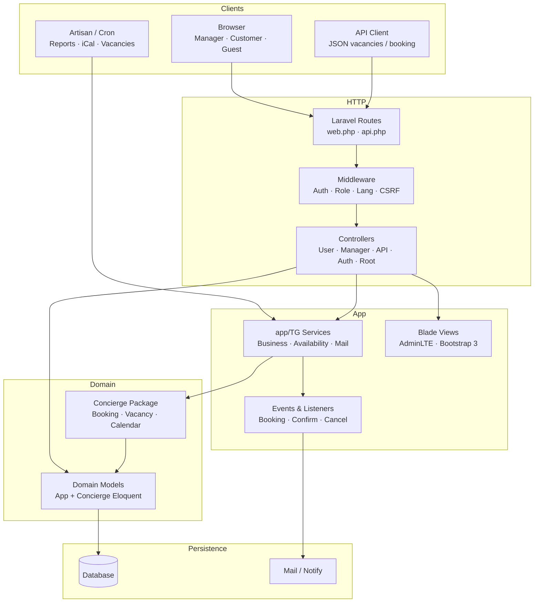
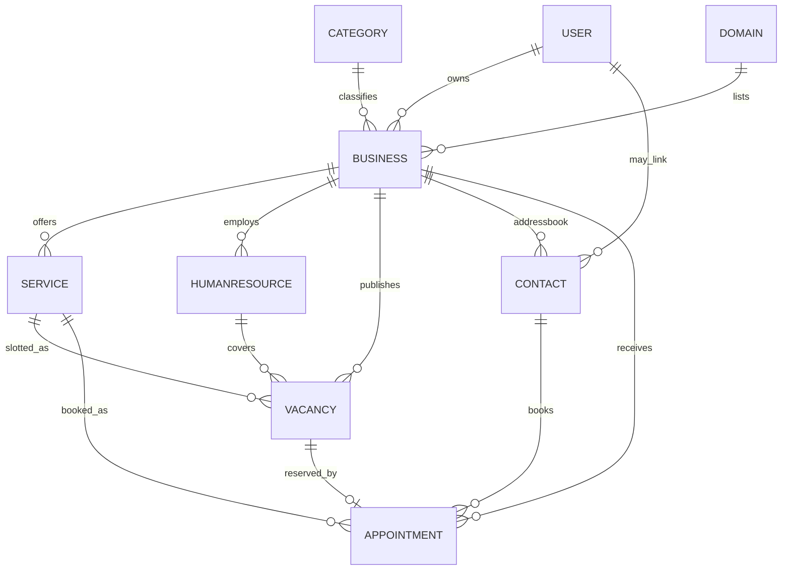
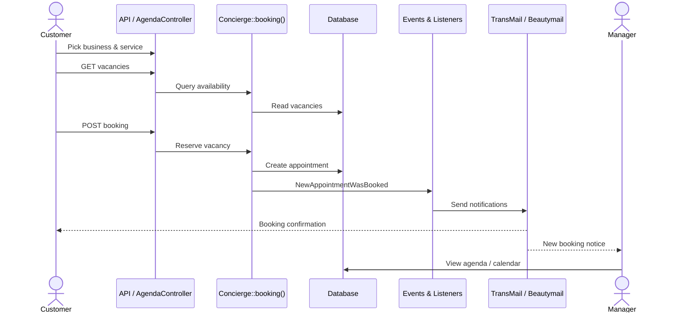

# Timegrid — Architecture Overview

Self-hosted online appointment and scheduling platform built on **Laravel 5.3** (PHP). The Laravel app owns auth, UI, orchestration, and notifications; the **`timegridio/concierge`** package owns the scheduling domain (vacancies, calendars, booking rules, and core models).

---

## Stack at a glance

| Layer | Technology |
| --- | --- |
| Framework | Laravel 5.3 |
| Language | PHP (≥ 5.6) |
| Booking domain | `timegridio/concierge` |
| UI | Blade + AdminLTE + Bootstrap 3 |
| Auth | Classic login + OAuth (Socialite) |
| Notifications | Events/Listeners → TransMail / Beautymail |
| Calendar export | iCalendar (`eluceo/ical`) |
| Scheduling | Artisan commands + jobs |

---

## System layers



**Architectural split**

- **Laravel app** — auth, UI, orchestration (`app/TG`), notifications
- **`timegridio/concierge`** — vacancies, calendars, booking rules, core scheduling models
- **Views** — Blade under `resources/views`

---

## HTTP surfaces

| Prefix / area | Controllers | Purpose |
| --- | --- | --- |
| `/` | Welcome, Guest | Landing & public business pages |
| `/user/*` | `User\*` | Wizard, agenda, directory, preferences |
| `/{business}/manage/*` | `Manager\*` | Dashboard, staff, services, vacancies |
| `/{business}/user/*` | `User\*` | Self-service booking & contacts |
| `/api` & AJAX | `API\*` | Vacancies lookup & booking posts |
| `/root` | `Root\*` | Platform admin |

Route files: `routes/web.php`, `routes/api.php`.

---

## Domain packages

### `app/TG` (application services)

Business registration/setup, availability & iCal sync, search, timezone detection, TransMail, dashboard tokens.

Key areas:

- `BusinessService`, `Business/Dashboard`, `Business/Token`, setup helpers
- `Availability/AvailabilityService`, `Availability/ICalSyncService`
- `SearchEngine`, `DetectTimezone`, `TransMail`
- `Repositories/UserRepository`

### `timegridio/concierge` (booking domain)

High-level booking manager with:

- `BookingManager`
- `VacancyManager` (+ parser / template builder)
- Timeslot / Dateslot calendars
- `TimetableStrategy`
- Addressbook helpers
- Eloquent models: Business, Service, Appointment, Vacancy, Contact, Humanresource, etc.

### Async / scheduled

| Type | Name | Role |
| --- | --- | --- |
| Job | `FetchICalFile` | Pull external calendars |
| Command | `AutopublishBusinessVacancies` | Publish availability |
| Command | `SyncICal` | Sync iCal sources |
| Command | `SendBusinessReport` | Business digests |
| Command | `SendRootReport` | Platform digests |

---

## Domain model



| Entity | Owned by | Relates to | Role in product |
| --- | --- | --- | --- |
| User / Role / Permission | `app/Models` | Business (owner), Contact | Auth & RBAC |
| Business | Concierge | Services, Staff, Vacancies, Contacts | Tenant / shop |
| Service (+ ServiceType) | Concierge | Business, Vacancies, Appointments | Bookable offering |
| Humanresource (Staff) | Concierge | Business, Vacancies, iCal link | Who delivers service |
| Vacancy | Concierge | Business, Service, Staff, Appointment | Open availability slot |
| Appointment | Concierge | Vacancy, Contact, Service | Confirmed / soft booking |
| Contact | Concierge | Business, User (optional link) | Addressbook customer |
| Preference | Both | User / Business | Locale, strategy, settings |
| Domain / Category | Concierge | Business | Marketplace listing / strategy |

---

## Booking request path



1. Customer picks a business
2. Client loads vacancies (API)
3. POST booking via `User\AgendaController` or `API\BookingController`
4. `Concierge::booking()` reserves a Vacancy
5. Fires `NewAppointmentWasBooked` (or soft-book event)
6. Listeners send email notifications
7. Manager agenda & calendar refresh from Appointment models

### Role views

| Role | Flow |
| --- | --- |
| **Customer** | Wizard → business home → timeslot/dateslot picker → store appointment → optional soft-appointment email validation |
| **Manager** | Dashboard, addressbook, staff, services, vacancy publish, agenda, FullCalendar, notifications |
| **System** | Event → listener email fan-out; iCal export token; scheduled vacancy autopublish and reports |

---

## Event → notification map

| Event | Listener(s) | Outcome |
| --- | --- | --- |
| `NewUserWasRegistered` | `AutoConfigureUserPreferences`, `SendMailUserWelcome` | Prefs + welcome email |
| `NewAppointmentWasBooked` | `SendBookingNotification` | Owner/customer booking mail |
| `NewSoftAppointmentWasBooked` | `SendSoftAppointmentValidationRequest` | Validation request |
| `AppointmentWasConfirmed` | `SendAppointmentConfirmationNotification` | Confirm notice |
| `AppointmentWasCanceled` | `SendAppointmentCancellationNotification` | Cancel notice |
| `NewContactWasRegistered` | `LinkContactToExistingUser` | Attach contact to user |

Defined in `app/Providers/EventServiceProvider.php`.

---

## Key directories

```text
timegrid/
├── app/
│   ├── Console/Commands/     # Scheduled tasks
│   ├── Events/ · Listeners/  # Notification pipeline
│   ├── Http/Controllers/     # User · Manager · API · Auth · Root
│   ├── Jobs/                 # FetchICalFile
│   ├── Models/               # User, Role, Permission
│   ├── Policies/             # Business, Contact authorization
│   └── TG/                   # Application service layer
├── routes/                   # web.php, api.php
├── resources/views/          # Blade UI (manager, user, guest, emails)
├── database/migrations/      # Schema
└── vendor/timegridio/concierge/  # Booking domain package
```

---

## Product context

See [PRODUCT_OVERVIEW.md](./PRODUCT_OVERVIEW.md) for the business/product summary.

Local demo (when running): `http://127.0.0.1:8000`
